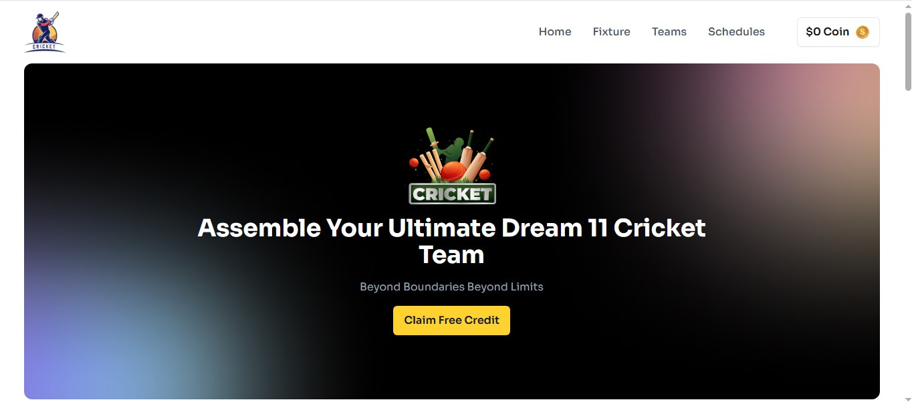
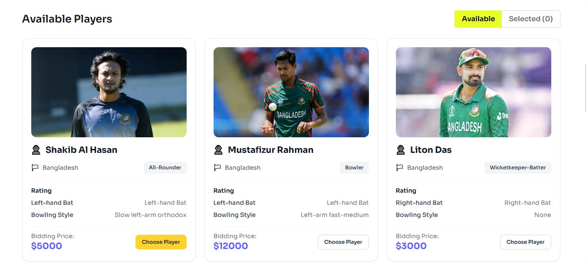

# Dream 11 Cricket Team

## Description

A modern and responsive cricket team selection web application built with **React, TypeScript, Tailwind CSS, and DaisyUI**. Users can claim free credits, browse available players, select players within their budget, and manage their selected team.

**GitHub Repo:** [https://github.com/mrrakib5007/bpl-dream-11](https://github.com/mrrakib5007/bpl-dream-11) 

**Live Preview:** [https://mr-bpl-dream-11.netlify.app](https://mr-bpl-dream-11.netlify.app)

## Features

- 🎁 **Free Credit Claim** - Claim 50,000 free credits and prevent duplicate claims.
- **Credit Management** - Player bidding prices are deducted from the available credits.
- **Available Players** - Browse players with their name, country, role, batting style, bowling style, and bidding price.
- **Player Selection** - Select players based on available credits.
- **Maximum 6 Players** - Users can select a maximum of 6 players.
- **Remove Players** - Remove selected players and automatically restore their bidding price.
- **Available / Selected Tabs** - Switch between available players and selected players.
- **Selected Player Counter** - Displays the current selected player count out of 6.
- **Toast Notifications** - Provides success and error feedback using React Toastify.
- **Responsive Design** - Optimized for mobile, tablet, and desktop devices.
- **Responsive Navbar** - Includes a mobile hamburger menu and desktop navigation.
- **Consistent Player Images** - Uses `object-cover` and `object-center` for consistent image cropping.
- **Suspense Data Loading** - Loads player data asynchronously using React Suspense.

## Technologies Used

- **React**
- **TypeScript**
- **Vite**
- **Tailwind CSS**
- **DaisyUI**
- **React Icons**
- **React Toastify**
- **Google Fonts - Sora**

## Project Preview

  

  

## Developer

**MrRakib5007**

Built with ❤️ using React, TypeScript, and Tailwind CSS.